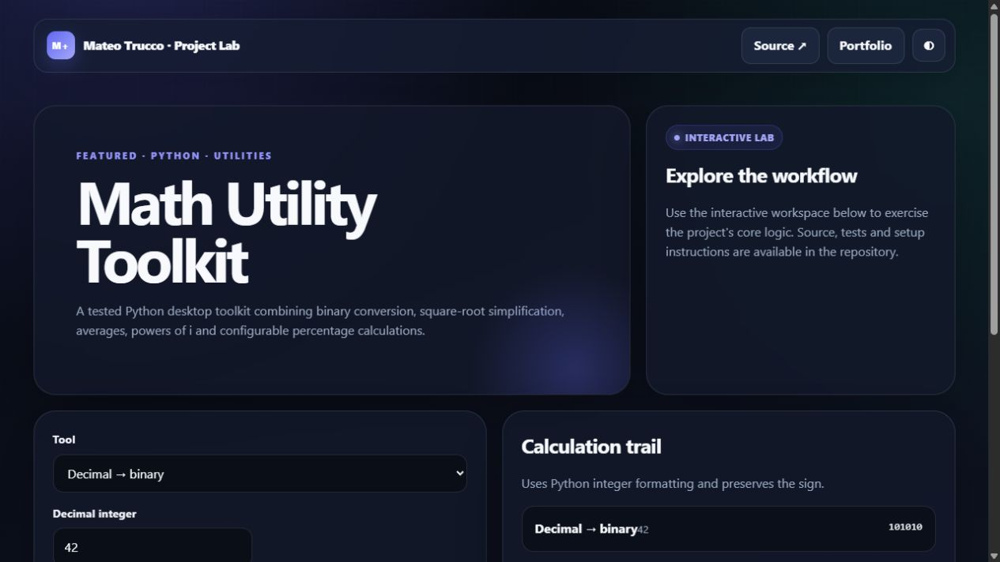

# Math Utility Toolkit

Five small learning projects consolidated into one application:

- Decimal/binary conversion
- Square-root simplification
- Average calculator
- Powers of the imaginary unit `i`
- Percentage/tax-style calculation

The logic is separated from the interface, validates finite/range-safe values and has automated tests.

```bash
python main.py
python -m pytest tests
```

---

## Interactive preview

[](https://mateotrucco.github.io/math_toolkit/)

**[Open the live experience](https://mateotrucco.github.io/math_toolkit/)** · [View the portfolio](https://mateotrucco.github.io/)

## Engineering baseline

- Business logic separated from presentation
- Automated tests and GitHub Actions CI
- Responsive, keyboard-friendly browser experience
- MIT licensed and documented setup

